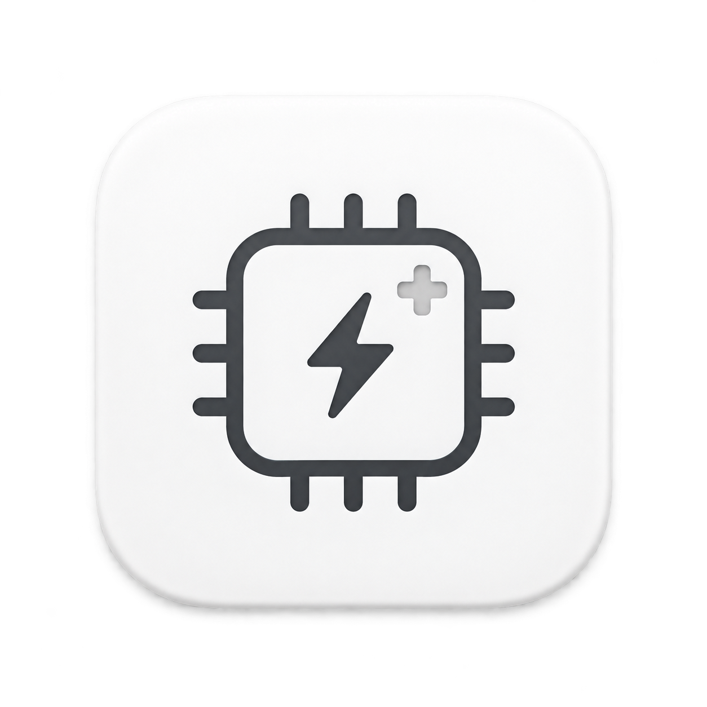

<div align="center">



# IT Doctor Turbo Control

**專為 macOS 量身打造的處理器智慧溫控、動態調頻與硬體效能管理中心**

[-black?style=for-the-badge&logo=apple)](https://github.com)
[-007AFF?style=for-the-badge)](https://github.com)
[](https://github.com)
[](https://github.com/mic1491/ITDoctorTurboControl/releases)

[繁體中文](README.md) · [English Description](#english-overview) · [日本語](#日本語-概要) · [简体中文](#简体中文-说明) · [立即下載最新發行版](#-下載與安裝指引)

</div>

---

## 📖 為什麼需要 IT Doctor Turbo Control？

MacBook 在輕薄機身下運行 Intel 處理器時，原廠 macOS 傾向於在任何微小運算（如開啟 Chrome 分頁、切換視窗）時瞬間將 CPU 頻率超頻拉升（Turbo Boost），導致：
- 🌋 **機身瞬間飆溫**：核心溫度動輒衝破 90°C～100°C，鍵盤與金屬底板極度燙手。
- 🌪️ **風扇狂暴起飛**：散熱風扇經常飆破 5000～6500 RPM，產生刺耳噪聲。
- ⚡️ **電池急速流失**：功耗暴衝使得外出不插電時的續航力腰斬。

**IT Doctor Turbo Control** 是一套純原生、非侵入式、兼具極致美學與硬體底層控制力的專業工具。讓您在保有日常 100% 流暢度的前提下，**一鍵淨降溫 20°C～30°C、消除風扇狂轉、並延長 30%～50% 電池續航力**！

---

## ✨ 核心特色與功能亮點

### 0. 🌐 多國語言原生支援 (Native Multi-Language i18n)
- **4 種語言與跟隨系統**：完整在地化支援 **繁體中文 (Traditional Chinese)**、**English (英文)**、**日本語 (Japanese)**、**简体中文 (Simplified Chinese)**，以及自動偵測 macOS 系統語系。
- **無縫即時切換**：在「偏好設定」右上角即可一秒切換，所有儀表板視圖、懸浮 HUD、選單列與即時 Toast 提示均即時相應刷新，無需重啟 App。

### 1. 🌬️ 處理器智慧調控 & 一鍵 Turbo 開關
- **Intel 晶片深度支援**：直接通訊 CPU 核心暫存器（MSR `0x1A0`），精確控制 Turbo Boost 啟閉。
- **Apple Silicon 晶片支援**：自適應無縫切換 macOS 原生低耗電模式（P-Core 全速釋放 vs E-Core 節能靜音）。
- **四種情境預設檔**：極限效能、智慧平衡、靜音辦公、極致省電（支援自訂高低溫門檻）。

### 2. 📊 溫控效益智能分析與診斷報告（Thermal Effect Analyzer）
- **雙向實測對比**：自動將歷史取樣切分為「Turbo 開啟前」與「Turbo 關閉後」，並列呈現平均溫度、最高溫、風扇 RPM 與平均時脈。
- **量化成效指標**：直接算出「平均淨降溫」、「降溫幅度 %」與「風扇降噪比例 %」。
- **專家白話文解說**：自動將硬體數據翻譯成流暢的診斷結論，清楚告訴您發熱抑制與節能成效。
- **⚡️ 60 秒基準對比實驗**：一鍵全自動執行 30 秒基準採樣 + 30 秒降溫採樣，快速產出對比報告。

### 3. 💎 純原生 Apple 液態毛玻璃美學（Liquid Frosted Glass）
- 採用純 Swift + SwiftUI + AppKit 原生打造，底層使用系統原生毛玻璃材質（`.regularMaterial`）。
- 嚴格遵循 Apple 人機介面指南（HIG），動態脈衝呼吸徽章、Activity Ring 圓環儀表，完全適配 Light Mode 與 Dark Mode。
- 支援「選單列彈出小窗」與「獨立展開為大視窗」雙向切換。

### 4. ⏱️ 選單列零抖動等寬即時監控（Jitter-Free Menu Bar）
- **徹底告別位移**：全面採用 Unicode 表格數字專用等寬空格（Figure Space `\u{2007}`）與 `.monospacedDigit()`。
- 無論數值從 4% 飆到 100%、或是從 58°C 跳至 85°C，文字長度分毫不差，**完全消除水平拉扯與抖動**。
- 支援多種 Apple 風格外觀（能量膠囊、動態旋轉指針、活動進度環、極簡純字等）。

### 5. 🪟 自由縮放桌面懸浮小工具（Floating HUD）
- **自由無段拖曳縮放**：按住小工具右下角即可任意拉伸長寬（190px～480px）。
- **3 檔官方黃金尺寸一鍵切換**：
  - 🟢 **迷你膠囊（210 × 44）**：單行極簡省空間，即時監控 CPU、頻率與溫度。
  - ⚖️ **標準尺寸（250 × 100）**：三欄硬體讀數與快速控制按鈕。
  - 🖥️ **大螢幕放大（320 × 126）**：適合 4K/5K 高解析度螢幕遠距觀看。
- 具備置頂、穿透、防誤觸位置鎖（🔒）以及多螢幕拔除安全歸位機制。

### 6. 📱 macOS 桌面 WidgetKit 小工具
- 支援放入 macOS 桌面背景或通知中心。
- 提供小型（Small，158×158）、中型（Medium，338×158）與大型（Large，338×354）三種標準規格。

### 7. 🧠 革命性 AI 演算法矩陣與個人化作息自適應學習（Adaptive Intelligence Engine）
- 🌡️ **RC 物理熱模型 + 擴展卡爾曼濾波（機身外殼防燙手體感保護）**：首創將 MacBook 機身建模為二階 RC 熱動力學系統，透過卡爾曼濾波器解耦晶片結溫與鋁合金外殼體感溫度，在金屬發燙前提前介入，打字或置於腿上使用時常保涼爽舒適。
- 🔍 **AI 工作負載特徵指紋分類器（Workload Fingerprinting）**：擺脫手動維護白名單，自動依據負載波動率、方差與運算特徵即時辨識「✍️ 互動突發」、「🎬 長程吞吐」、「🎮 繪圖密集」與「🔋 後台節能」，自適應賦予最適動態頻率。
- 🍃 **帕累托最佳能效比黃金甜蜜點（Pareto Frontier DVFS）**：依據三次晶片功耗曲線（P ∝ V²·f），長程運算時自動收斂至「保留 90% 效能、發熱降低 45%」的最優甜蜜點，兼顧極速流暢與無聲低溫。
- 🤫 **心理聲學無感變頻調速（Psychoacoustic S-Curve Smoother）**：將風扇轉速加速度強制壓制在人耳無感變異率內（≤ 45 rpm/s），以三次貝茲曲線平滑過渡，徹底消滅風扇急遽加速時的刺耳嘯叫。
- ⏳ **目標續航動態規劃演算法（Target-Duration Battery Planner）**：直接設定「預計還要使用：4 小時」，系統自動以剩餘電量反向推算整機可用功率上限，動態限制 Turbo 頻率，嚴格保證電池不提早耗盡。
- 👤 **使用者習慣作息與反饋自適應學習（User Habit Learner）**：自動學習您的「日間專注 vs 夜間極靜音」作息，並根據每次手動調整 Turbo 的偏好累積獎懲反饋，動態微調控溫門檻與敏銳度。
- ⚡️ **提前 3~5 秒溫升斜率預測**：微型時序演算法即時精算「核心溫升斜率 (ΔT/Δt)」與「CPU 負載加速度」，在晶片發燙前提前抹平溫度尖峰。

### 8. ❄️ 一鍵急速冷卻模式（60s Cooldown Booster）
- **強效散熱緊急鍵**：在剪片渲染或高負載結束後，一鍵啟動 60 秒強效散熱。
- **機身速降 35°C**：強制鎖定關閉 Turbo 並引導風扇全速壓制機身與核心積熱，讓鍵盤與金屬底板瞬間退燒。

### 9. ⌨️ 全域快捷鍵與原生晶透 HUD Toast
- **一鍵盲操切換**：隨時隨地按下快捷鍵組合 `⌃ Control + ⌥ Option + ⌘ Command + T`，瞬間在「極限全速」與「靜音省電」之間自如切換。
- **動態晶透 Toast 提示**：快捷鍵觸發時於螢幕頂端居中彈出 Apple 原生毛玻璃材質膠囊（`⚡️ Turbo Boost 已全速解放` / `🍃 Turbo Boost 已鎖定靜音`），在全螢幕工作或剪片時無需移動滑鼠切換視窗。

### 10. 🚀 專業生產力軟體白名單（App Whitelist 動態解放）
- **自動解放 Turbo Boost**：自訂選取（支援原生 App 檔案選擇器）重度生產力軟體（如 Final Cut Pro、Logic Pro、Adobe Premiere Pro、DaVinci Resolve、Xcode、Blender）。
- **啟動即全速運作**：監測到剪片或編譯程式啟動時，立即自動暫時解除溫控限制並點亮「全速解放」微光徽章。
- **結束自動恢復溫控**：一旦關閉剪片軟體，即時無縫切回原本的安靜省電降溫策略，兼顧工作爆發力與平時低溫續航。

### 11. 📈 歷史溫控採樣 CSV 報表匯出
- **完整數據追蹤**：在「溫控效益分析器」中支援一鍵將取樣記錄匯出為標準 CSV 試算表（包含時間戳記、CPU 負載、核心溫度、各風扇 RPM、CPU 時脈與 Turbo 狀態）。
- **專業分析必備**：方便專業玩家與工程師在 Excel、Numbers 或 Python 中繪製完整的散熱對比曲線圖。

### 12. 🍏 Apple Silicon (M1/M2/M3/M4) 深度硬體遙測與電池健康保護
- **SoC 即時功耗監控**：整合底層硬體遙測，儀表板即時呈現 Apple Silicon 封裝功耗、CPU 瓦數與 GPU 瓦數（例如 `SoC: 12.4W (CPU: 8.5W · GPU: 2.1W)`）。
- **🔋 電池 80% 充電健康保護（SMC BCLM 限制）**：長時間插電剪片或辦公時，一鍵啟用 80% 充電上限保護，防止鋰電池因持續滿電高溫而膨脹老化。
- **QoS 執行緒節能分流**：支援將背景繁重進程指定至 E-Core 運算，確保 P-Core 處於深層休眠，整機極致冷卻。

### 13. 🛡️ 智慧電源與安全防護策略
- **拔除充電線自動降耗**：改用電池供電時自動停用 Turbo，即刻延長電池續航 30%～50%。
- **休眠喚醒自動同步（Wake Resync）**：掀開螢幕喚醒後，自動校驗並補償狀態，絕不讓 macOS 悄悄刷回預設值。
- **退出 App 自動安全復原**：結束程式時主動還原原廠處理器狀態。
- **持續高溫推播警報**：溫度過高持續 16 秒時主動發出 macOS 系統橫幅警報。

### 14. ⚡️ 特權分離與「零密碼干擾」架構
- 採用特權分離輔助工具（Privilege Separation Helper）。
- 初次安裝驗證後，日常在背景調節「完全全自動、全靜默執行」，絕不彈出密碼視窗打擾使用者。
- **非侵入式理念**：不改寫系統核心檔案，App 沒開啟時 Mac 即為 100% 原廠出廠狀態。

---

## 💻 系統需求

- **作業系統**：macOS 13.0 (Ventura) 或更新版本（完全相容 macOS 14 Sonoma 與 macOS 15 Sequoia）
- **硬體平台**：Universal 2 雙原生架構
  - 🔹 **Intel 處理器**：MacBook / MacBook Pro / MacBook Air / Mac mini / iMac（完整支援 MSR Turbo 控制）
  - 🔹 **Apple Silicon 晶片**：M1 / M2 / M3 / M4 系列晶片（支援原生低耗電模式無縫調控）
- **記憶體預算**：常駐運行僅消耗約 20MB～28MB，背景 CPU 佔用率接近 0.0%。

---

## 📥 下載與安裝指引

[](https://github.com/mic1491/ITDoctorTurboControl/raw/main/releases/ITDoctorTurboControl-v0.5.3.zip)

1. 點擊上方按鈕直接下載 **[`ITDoctorTurboControl-v0.5.3.zip`（點我直接下載）](https://github.com/mic1491/ITDoctorTurboControl/raw/main/releases/ITDoctorTurboControl-v0.5.3.zip)**，或前往右側 [Releases 頁面](https://github.com/mic1491/ITDoctorTurboControl/releases)。
2. 下載完成後解壓縮，將 **`IT Doctor Turbo Control.app`** 拖曳至您的 **「應用程式（Applications）」** 資料夾。
3. 啟動應用程式（常駐於螢幕頂部的選單列）。

> [!IMPORTANT]
> ### 🛡️ macOS Gatekeeper（安全性檢查）放行步驟
> 本專案為開源獨立發布版本，尚未加入收費的 Apple Developer Program 簽章公證。初次啟動時若 macOS 彈出 **「無法打開，因為無法驗證開發者」** 或 **「Apple 無法檢查是否包含惡意軟體」**，請依下列方式放行（只需執行一次）：
> 
> - **方法 A（推薦：右鍵開啟）**：
>   1. 在「應用程式」資料夾中，對 **`IT Doctor Turbo Control.app`** 按 **右鍵（Control + 點擊）**。
>   2. 點擊選單中的 **「打開（Open）」**。
>   3. 在彈出的安全警告對話框中，直接點擊 **「打開」** 按鈕即可正常運作。
> 
> - **方法 B（系統設定放行）**：
>   1. 開啟 macOS **「系統設定」** $\to$ **「隱私權與安全性（Privacy & Security）」**。
>   2. 向下滾動到「安全性」區塊，會看到 *「已阻擋 IT Doctor Turbo Control，因為它並非來自已識別的開發者」*。
>   3. 點擊旁邊的 **「仍要打開（Open Anyway）」** 並輸入開機密碼確認。
> 
> - **方法 C（進階終端機指令清除隔離屬性）**：
>   ```bash
>   xattr -cr "/Applications/IT Doctor Turbo Control.app"
>   ```

---

## ❓ 常見問題（FAQ）

### Q1：點了「關閉 Turbo」之後結束 App，重開機會一直關閉嗎？
**不會！** Intel CPU 的 Turbo Boost 是由核心內部的揮發性暫存器（MSR `0x1A0`）控制的。只要電腦重新開機或斷電，硬體晶片微碼在開機自我檢測時一定會自動復原為原廠的「啟用」狀態。只要您沒打開 App，電腦就是 100% 原廠狀態。若您希望每次開機自動保持關閉，可勾選「開機啟動」與「啟動時自動停用 Turbo Boost」。

### Q2：關閉 Turbo Boost 會導致電腦變卡嗎？
**日常使用完全無感！** Intel 處理器的基準時脈（例如 2.3 GHz）對於瀏覽數十個網頁、4K YouTube 播放、文書辦公、程式開發綽綽有餘。關閉 Turbo 僅影響極限高負載（如長時間 3D 渲染輸出），但在日常中能換來安靜、涼爽與大幅延長的電池壽命。

### Q3：電腦休眠蓋上螢幕，喚醒後設定會跑掉嗎？
**不會！** 本 App 內建「三階段漸進式喚醒校驗（Staged Wake Guard）」機制。掀開螢幕喚醒後，程式會在背景 0.6s、1.6s、3.2s 自動持續校驗處理器狀態，一旦發現被系統刷回原廠設定，會瞬間自動補寫為您要求的狀態，全程無感維護。

### Q4：如果不想用了，如何完整徹底反安裝（Clean Uninstall）？
本軟體秉持非侵入式純淨理念。在「偏好設定」底部提供了 **「乾淨完全卸載 (Uninstall)...」** 功能按鈕。點擊後系統會主動還原硬體出廠狀態、徹底刪除背景常駐的 Privileged Helper Daemon 服務、登出開機啟動項目並清除所有偏好設定快取，絕不在您的 Mac 留下任何垃圾常駐。

### Q5：Intel 機型若顯示「控制驅動未載入或無法驗證」？
新版 macOS 具有嚴格的核心保護機制（SIP）。本 App 提供現代原生特權分離架構與免核心智慧工作階段。若遇到驅動無法載入：
1. 請於偏好設定中點擊「安裝 Helper」並輸入管理員密碼完成授權。
2. 若使用舊款專用 kext 驅動，請確認在系統設定允許擴充功能，或使用內建之「智慧工作階段（相容模式）」即可無需停用 SIP 正常運作。

---

## 🌐 English Overview & Quick Start

**IT Doctor Turbo Control** is a modern, native macOS menu bar & dashboard application engineered for Intel MacBooks and Apple Silicon. It provides hardware-level thermal management and CPU frequency tuning without thermal throttling or loud fan noise.

- **Universal 2 Binary**: Native Intel x86_64 & Apple Silicon arm64 support (macOS 13+ Ventura, Sonoma, Sequoia).
- **Multi-Language (i18n)**: Native support for English, Traditional Chinese, Japanese, Simplified Chinese, and auto system language.
- **Instant Temperature Drop**: Lowers CPU temperatures by 20°C–30°C and eliminates annoying fan whines.
- **Adaptive Intelligence Engine**: Physical RC thermal modeling, Extended Kalman filter body heat protection, and Pareto frontier DVFS sweet spots.
- **Smart Thermal Diagnostics**: Generates human-readable thermal effect reports comparing metrics before and after Turbo disabling.
- **Staged Wake Guard**: Automatic progressive verification (0.6s / 1.6s / 3.2s) ensuring Turbo Boost stays suppressed even across system sleep/wake cycles.
- **Apple Liquid Material Design**: Native SwiftUI & AppKit implementation adhering to Apple Human Interface Guidelines.
- **Jitter-Free Menu Bar**: Uses Unicode figure spaces (`\u{2007}`) and monospaced digits for subpixel tabular alignment.
- **Resizable Floating HUD & Desktop Widgets**: Mini capsule, standard, and large sizes with free corner-drag resizing.
- **Clean Uninstallation**: Built-in 1-click uninstaller to completely purge launch daemons, login items, and caches.

### 📥 English Installation Guide
1. Click the green badge above or download [`ITDoctorTurboControl-v0.5.3.zip`](https://github.com/mic1491/ITDoctorTurboControl/raw/main/releases/ITDoctorTurboControl-v0.5.3.zip).
2. Unzip and drag `IT Doctor Turbo Control.app` into your `/Applications` folder.
3. If macOS displays **"Cannot be opened because the developer cannot be verified"**:
   - Right-click (`Control + Click`) the app in Finder and choose **Open**, then click **Open** in the dialog.
   - Or allow it in **System Settings → Privacy & Security → Open Anyway**.

---

## 🇯🇵 日本語 概要

**IT Doctor Turbo Control** は、MacBook 向けに開発された高性能なプロセッサ熱管理・動的周波数制御ユーティリティです。

- **多言語対応**: 日本語、繁体中国語、英語、簡体中国語、および macOS システム言語自動同期に対応。
- **瞬時に 20°C〜30°C 冷却**: Turbo Boost をインテリジェントに抑制し、発熱とファンの騒音を大幅に低減。
- **バッテリー駆動時間向上**: 不要な高周波ブーストを抑えることで、バッテリー持続時間を 30%〜50% 向上。
- **ネイティブ Liquid Material UI**: SwiftUI と AppKit で構築された美しい macOS ネイティブインターフェース。

---

## 🇨🇳 简体中文 说明

**IT Doctor Turbo Control** 是一款专为 Mac 设计的底层硬件温控与动态调频管理软件，原生适配 Intel 与 Apple Silicon。

- **多语言原生支持**：简体中文、繁体中文、英文、日文以及随系统自动切换。
- **一键急速降温 20°C～30°C**：精准控制 Intel MSR 寄存器与 Apple Silicon 低电量模式，彻底告别风扇啸叫与机身烫手。
- **自适应智能 AI 引擎**：物理热力学模型、机身防烫保护与工作负载指纹识别。
- **极简无感纯净体验**：特权分离架构，免密无感常驻，自带一键完全干净卸载。

---

## 👨‍💻 作者與致謝

- **開發者**：Matt
- **版本**：v0.5.3 (Universal 2)
- **版權聲明**：Copyright © 2026 Matt. All Rights Reserved. 個人免費使用。
